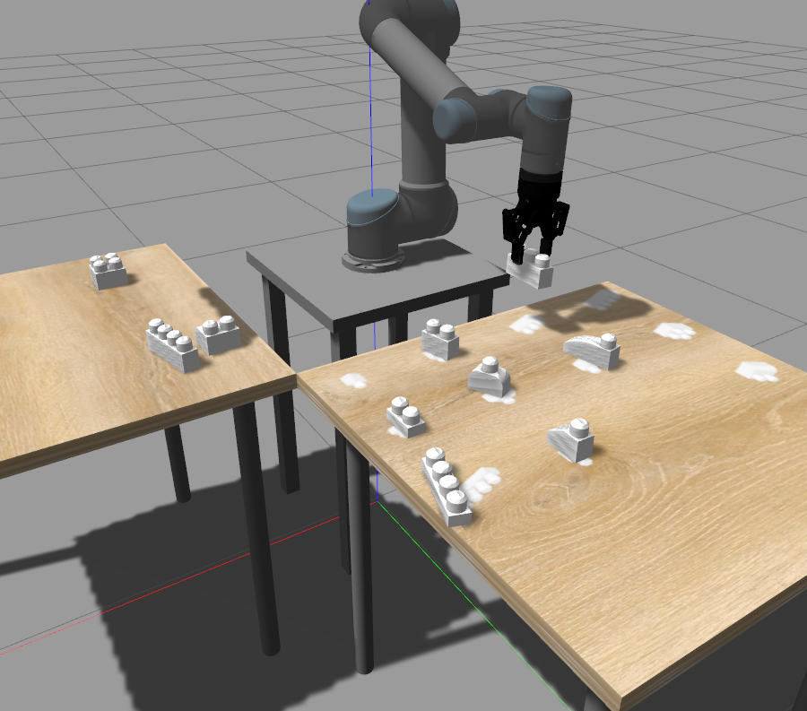

# Robotics Project Report



This document describes how the project has been implemented, going through all the technical choices and aspects. It is organized following project packages:

## `universal_robot` †


URDF-formatted (xacro) description of the complete lineup of [Universal Robot](https://www.universal-robots.com/)’s robots. For our demonstration we are using the [UR5 flexible collaborative robot arm](https://www.universal-robots.com/products/ur5-robot/) which perfectly fits our needs in terms of flexibility, size and adaptability. The arm can lift a payload up to 5kg, which greatly exceeds our needs for the project. It is also extremely fast and very adaptable to different end effectors.

<table>
  <tr>
   <td>Degrees of freedom
   </td>
   <td><code>6 rotating joints</code>
   </td>
  </tr>
  <tr>
   <td>Reach
   </td>
   <td><code>850 mm</code>
   </td>
  </tr>
  <tr>
   <td>Payload
   </td>
   <td><code>5 kg</code>
   </td>
  </tr>
  <tr>
   <td>Pose Repeatability
   </td>
   <td><code>± 0.03 mm</code>
   </td>
  </tr>
</table>

## `robotiq` †


URDF-formatted (xacro) description of the [Robotiq 2F-85](https://robotiq.com/products/2f85-140-adaptive-robot-gripper) gripper. We chose this particular gripper model as the end effector for our demonstration because of its ease of operation and the great support and coverage by the ROS community. We don’t need the gripping capabilities of a 3 finger gripper since we are dealing with well defined, big, squared shapes.

<table>
  <tr>
   <td>Stroke
   </td>
   <td><code>85 mm</code>
   </td>
  </tr>
  <tr>
   <td>Grip force
   </td>
   <td><code>20 to 235 N </code>
   </td>
  </tr>
  <tr>
   <td>Position resolution
   </td>
   <td><code>± 0.4 mm</code>
   </td>
  </tr>
  <tr>
   <td>Closing speed
   </td>
   <td><code>20 to 150 mm/s</code>
   </td>
  </tr>
</table>

## `x_robot`

URDF-formatted (xacro) description of the whole robot (arm + gripper). The arm and the gripper are joined together with a `robotiq_coupler`. This package also contains the configuration of the joint controllers:

- `shoulder_pan_joint_position_controller`
- `shoulder_lift_joint_position_controller`
- `elbow_joint_position_controller`
- `wrist_1_joint_position_controller`
- `wrist_2_joint_position_controller`
- `wrist_3_joint_position_controller`
- `gripper_controller`

and the launch files to spawn the robot in a gazebo world.

## `x_controller `‡

C++ source code for the business logic which controls robot movements and kinematics. It is used to find the motions path that the robot has to follow in order to reach the desired destination point in a 3D world.

The source included are:

- `ur5.cpp / .hpp , params.hpp`

  Utility class to control the joints of the UR5 manipulator sending ROS messages to its topic

- `gripper.cpp / .hpp`

  Utility class to control the Gripper (end effector) through ROS messages

- `kinematics.cpp / .hpp`

  Implementation of point to point motion planning (described above) to reach the destination point

- `x_controller_node.cpp`

  Implementation of the ROS node which calls “Blocks” service provided by x_vision package to get the lego blocks positions and orientations, and makes the manipulator move, take blocks with gripper, and put them in the defined final position, depending on the object class.

It is presented to the user as an interactive terminal application with commands that you can issue directly to the robot.

## Kinematics

Inside of this library, we implemented the logic which allows the robot to move, following the content of the course slides and the actual implementation in MATLAB scripts. We also used **a**,**d**,**ϑ** and **α** from the Denavit-Hartenberg convention, specific for the UR5 robot, with the information provided in their reports.

As written above, the main goal was obtaining a collection of points through which the robot must pass starting from the actual position and finishing in the desired one (point to point motion planning, abbreviated P2P). It works as follows: we used a fifth-degree polynomial (with time variable) because we want to impose initial and final position (fixed), initial and final velocity (0) and initial and final acceleration (0), to avoid drastic speed changes. Then we compute the coefficients for each joint angle, and we get our polynomial interpolation: we just need to pass initial angles and the actual time; at the end, starting from time 0 to _maxT with a step of 0.01s, we generate all the required points that will be passed to UR5 utility class_.

The most important one is the inverse kinematic, we used it to obtain all the possible angles of the joints which lead us to the desired point: we have done it by using a set of geometry rules.

Since the UR5 is a redundant manipulator the inverse kinematic give us 8 possible solution and here comes the _best_angles_ function: we filter unwanted solutions (like the ones that cause the robot to to move under the table or the ones with undefined angles) to keep the one that fit better for our goal, possibly using the most close angles to the actual ones, in order to minimize the movement required.

Other useful function are:

- \_ul2rotm and rotm2eul that are responsible for switching angle notation, from euler angles (RPY) to 3D rotation matrix, or vice versa
- create_homogeneous_matrix unify a 3D rotation matrix with a 3D vector position, getting an homogeneous matrix: this is a special 4D matrix that allows us to express a rotation and a translation all together, but since we want to keep the properties, we use affine mapping and add a row with [0 0 0 1]; get_position and get_orientation inverts this operation giving the matrix or the vector

## `x_linker`

Gazebo plugin to fix some of the bugs in the vendored Gazebo Server version that we used for our demonstration (v 11.6.0). Sadly working with gazebo has proven to be extremely difficult. The behaviour of the simulation software is often unpredictable or outright unstable. These incidents are not unique to us. It is a widespread problem in the ROS community.

To counteract this we decided to write a plugin to fix some of these issues. This allowed us to focus on the business logic of our demonstration instead of worrying about instabilities in our simulation software. The functionality of the plugin is the following:

- **Automatic attachment** of an object in the Gazebo scene to the gripper, creating a fixed joint between the gripper’s body and the object’s body
- … and **automatic release** of the object for the link created during the attachment phase.

This is put in place to prevent Gazebo from throwing an object around the scene unpredictably (and unrealistically) when trying to grab it.

**If we were to test this demonstration in the real world** we would control the gripper in order to get an effort estimation for a particular position and decide if it’s good to continue closing the gripper or if it’s enough to lift the object.

## `x_msgs`

In this package there are the definition of message types and service types exchanged by parts of our business logic.

The message type we use to share information about blocks classification, position and orientation is the following:

**Block**

```
geometry_msgs/Point obj
float64 x
float64 y
float64 z
float64 angle
string label
string orientation
```

The service we use to share blocks information from x_vision to x_controller packages is defined as follows:

**Blocks**

```
x_msgs/Block[] list
```

It gives a list of all the recognized objects in the scene, with its labels, positions, angles and orientations.

## `x_vision` ‡

We use [YOLOv5](https://github.com/ultralytics/yolov5) object detection system to recognize the lego blocks and individuate their position in the kinect camera image.

### Dataset

To get effective results we trained YOLO with a custom dataset, generated in Blender, in which we replicated the gazebo environment where the robot works.

The camera view is set in order to see only the table where we put blocks at the start of the simulation, with a resolution of 1024 x 1024 pixels.

To let the model recognize objects better, we added some noises on the dataset, in those ways:

- Adding shadows to the table texture
- Rotating the table texture
- Changing sun (light) parameters: energy, angle of rotation, specular factor

The blocks are spawned in different colours, to let YOLO recognize the block structure, whatever its color is.

Images and its labels are splitted into three sets, to perform the training, in this way:

- Train set (80%)
- Validation set (10%)
- Test set (10%)

Below here there is a chart comparison between our generated dataset and the provided dataset (mixing together the ones given for assignments 1, 2 and 3).


From this comparison we can deduce that the provided dataset failed to meet our demands in terms of accuracy, precision and recall. For example, after training epoch 20 we can observe that the provided dataset had a precision of roughly 11.1% while our custom dataset reached an impressive 97.6%. More importantly, the validation phase of our training revealed the biggest difference between the two datasets. We can see that the 3 reported loss functions (box, cls, obj) maintain a constant delta for all the training process and that the obj loss (which tracks the error rate in detecting what YOLO thinks it’s an object) actually grows over time, reaching at epoch 80 the same value achieved in epoch 3.

The two confusion matrices strike the biggest difference between the two training for the two datasets. Our custom dataset shows good confidence in inferring every block model with little confusion. On the other hand the provided dataset is not only confusing block model types but oftentimes doesn’t classify a valid object at all.

<table>
  <tr>
   <td>


   </td>
   <td>


   </td>
  </tr>
  <tr>
   <td>Custom Dataset
   </td>
   <td>Provided Dataset
   </td>
  </tr>
</table>

Our goal was to build a custom specialized object detection system which performs very well in a well defined environment, where the scene components are almost the same every time. We have figured out the more you train it with images likely to the one it will work on, the better it goes. Above charts support this statement.

### From 2D to 3D

Once trained, YOLO gives the bounding box of the detected object. The bounding box is not enough to establish the 2D position of a block, since that rectangle is not the contour of the block.

We need more detailed information about the contour of the block.

To do this, we follow these operations:

1. Take yolo bounding box and crop it from color image and depth image
2. Add some blur on depth image
3. Use [Canny](https://en.wikipedia.org/wiki/Canny_edge_detector) algorithm (OpenCV implementation) to find lines in the cropped depth image, combined with dilate and erode to get better results
4. Find the block contours
5. Find the bigger area contour and use it as block contour
6. Find the block centroid (center point: it looks for the point that is the most near to everyone else, that is the center one)
7. Transform center point coordinates to real world 2d coordinates
8. Get z coordinate from depth map center coordinates, mapping to real world ones
9. Get rotation angle of block, drawing the smallest rectangle which surrounds it, getting rectangle rotation and use it to establish block rotation
10. Detect circles in the blocks to establish if it is in upright position, taking the smallest rectangle (blank image with that rectangle)
11. If after recognition there is not certainty about the block type (Z1 vs Z2 blocks), check object depth
12. Generate and return service message

## `x_world`

World and launch source files with specific definitions of the task assigned to us for the demonstration.

- For task 1 to 3 we are using a world, which has three tables
  - One for the robot to stand on
  - One for the objects to be initially placed in
  - One textured the silhouettes of the blocks where the objects will be placed by the robot once classified.
- For task 4 we are using a world, which has three tables
  - One for the robot to stand on
  - One for the objects to be initially placed in
  - One for the objects to be placed in a known configuration by the robot

The provided STL models of the lego blocks weren't optimized for the simulation environment. If the scene contained a moderate amount of block meshes (5-10) the simulation time on lower-end hardware was drastically reduced by over 70%.

We batch-processed all the meshes using Blender’s limited dissolve to reduce the number of vertices of every single block type. The models in our simulation have roughly 85% less vertices than the ones provided. This also allowed us to run the simulation in our laptops without suffering an unnecessarily large performance loss.

<table>
  <tr>
   <td>


   </td>
   <td>


   </td>
  </tr>
  <tr>
   <td>Raw mesh (5306 vertices)
   </td>
   <td>Simplified mesh (779 vertices)
   </td>
  </tr>
</table>

## `technical documentation`

Requirements:

1. Full desktop installation of ROS Noetic in your host system
   1. Official installation : [http://wiki.ros.org/noetic/Installation](http://wiki.ros.org/noetic/Installation/Ubuntu)
   2. Conda based environment: [https://robostack.github.io/GettingStarted.html](https://robostack.github.io/GettingStarted.html)
2. Python installation, version >=3.8

Steps:

1. Activate ROS Noetic environment

```
source /opt/ros/noetic/setup.bash
```

2. Install required Python packages:

```
sudo apt install python3-pip python3-rosdep python3-rosinstall python3-rosinstall-generator python3-wstool build-essential python3-rosdep
```

3. Initialize rosdep

```
sudo rosdep init && rosdep update
```

4. Download our demonstration (Google Drive, Github)
5. Change directory to our demonstration
6. Install ROS dependencies demonstration

```
rosdep install --from-paths src --ignore-src -r -y
```

7. Install Python dependencies demonstration

```
python3 -m pip install -r requirements.txt
```

8. Build the packages of the demonstration

```
make
```

9. Source the artifacts generated by the build

```
source devel/setup.bash
```

10. Start the demonstration’s simulation environment

```
make run
```

11. Start yolo detection system node

```
rosrun x_vision node.py
```

12. Start robot node

```
rosrun x_controller x_controller_node
```

13. Setup one of the 4 tasks

```
rosrun x_world setup_{1, 2, 3, 4}.py
```

14. Cleanup the simulation environment

```
rosrun x_world cleanup.py
```

---

† – The package is a third-party dependency, with licenses correctly attributed to the respective owners.

‡ – The package contains third-party dependencies, with licenses correctly attributed to the respective owners.
